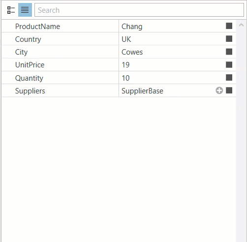

<!-- default badges list -->

[](https://supportcenter.devexpress.com/ticket/details/E4855)
[](https://docs.devexpress.com/GeneralInformation/403183)
<!-- default badges end -->

# WPF PropertyGrid - Add an Object with Predefined Property Values to a Collection

This example demonstrates how to use a collection editor to add an item to a collection. Set one of these properties to `true` to allow users to add new items to the collection:

* [PropertyGridControl.UseCollectionEditor](https://docs.devexpress.com/WPF/DevExpress.Xpf.PropertyGrid.PropertyGridControl.UseCollectionEditor).
  
  Toggles collection editing for the entire property grid.

* [CollectionDefinition.UseCollectionEditor](https://docs.devexpress.com/WPF/DevExpress.Xpf.PropertyGrid.CollectionDefinition.UseCollectionEditor).
  
  Toggles collection editing for individual collections.
  
```xaml
<dxprg:CollectionDefinition UseCollectionEditor="True" >
```
This image illustrates how to add an item to a collection:



## Implementation Details

[XamlInitializer](https://docs.devexpress.com/WPF/DevExpress.Xpf.PropertyGrid.XamlInitializer) class allows you to use XAML to add items to a collection. Add the [XamlInitializer](https://docs.devexpress.com/WPF/DevExpress.Xpf.PropertyGrid.XamlInitializer) instance to the [Window.Resources](https://docs.microsoft.com/en-us/dotnet/api/system.windows.window.resources?view=netframework-4.8) collection and specify the [TypeDefinition](https://docs.devexpress.com/WPF/DevExpress.Xpf.PropertyGrid.TypeDefinition) items that an end-user can add to a collection.

```xml
<Window.Resources>
    <ResourceDictionary>
        <dxprg:XamlInitializer Initialize="XamlInitializer_Initialize" x:Key="xamlInitializer">
            <dxprg:TypeDefinition Type="{x:Type local:Supplier}"  Name="Supplier" Description="New Supplier"/>
        </dxprg:XamlInitializer>
    </ResourceDictionary>
</Window.Resources>
```

Add an event handler to the [XamlInitializer.Initialize](https://docs.devexpress.com/WPF/DevExpress.Xpf.PropertyGrid.XamlInitializer.Initialize) event to set the initial values for the new object's properties.

```csharp
private void XamlInitializer_Initialize(object sender, InstanceInitializeEventArgs e) {
    e.Instance.FirstName = "FIRSTNAME";
    e.Instance.LastName = "LASTNAME";
    e.Instance.Phone = "PHONE";
}
```

## Documentation

* [Collection Editing](https://docs.devexpress.com/WPF/15719/controls-and-libraries/property-grid/property-definitions/collection-definitions#collection-editing)
* [XamlInitializer](https://docs.devexpress.com/WPF/DevExpress.Xpf.PropertyGrid.XamlInitializer)

<!-- default file list -->
## Files to Review

* [MainWindow.xaml](./CS/MainWindow.xaml) (VB: [MainWindow.xaml](./VB/MainWindow.xaml))
* [MainWindow.xaml.cs](./CS/MainWindow.xaml.cs) (VB: [MainWindow.xaml.vb](./VB/MainWindow.xaml.vb))
* [Products.cs](./CS/Products.cs) (VB: [Products.vb](./VB/Products.vb))
<!-- default file list end -->
